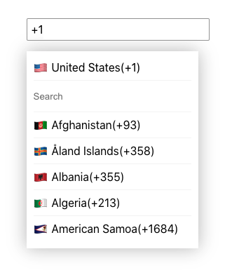

# <a href="https://wesley16838.github.io/phone_inputbox_component/" target="_blank">Phone_inputbox_component</a>

> Stuff_assessment_component

> A phone number inputbox with nation code

[](https://www.npmjs.com/package/if-node-version)
[](https://www.npmjs.com/package/if-node-version)
[](https://travis-ci.org/mysticatea/if-node-version)

[]()

- On focus: position cursor right to the code and open widget
- Clicking outside the widget will close it (but not in the input area)
- Clicking on ‘Search’ - allow typing (focus) and open all options below (scrollable)
- On typing - show related results
- On selecting - switch to the selected country, show ‘Search’ as default, close the list, and position the cursor right to the code

---

## Table of Contents

- [Installation](#installation)
- [License](#license)

---

## Installation

### Clone

- Clone this repo to your local machine using `https://github.com/Wesley16838/stuff_assessment.git`

### Setup

> Open the terminal in the Visual Studio
> and run the code in the terminal as follows:

```shell
$ npm i
$ npm start
```

> Open [http://localhost:3000](http://localhost:3000) to view it in the browser.

---

---

## License

- **[MIT license](http://opensource.org/licenses/mit-license.php)**
